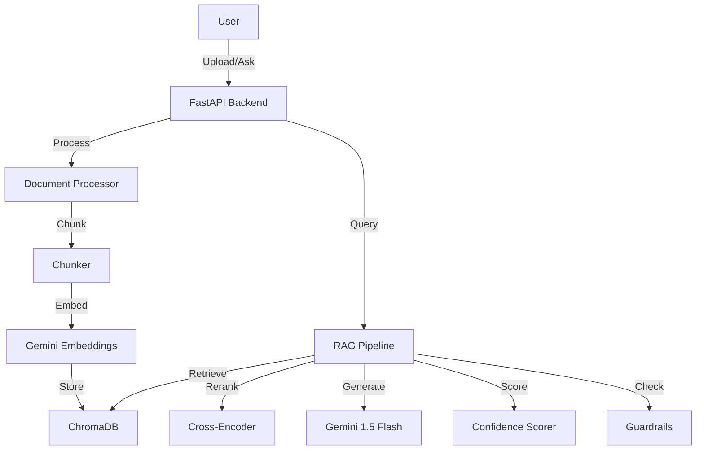

# Ultra Doc-Intelligence

A quick POC for analyzing logistics documents using RAG (Retrieval Augmented Generation).

Upload a Bill of Lading, Rate Confirmation, or similar doc and ask questions about it. The system finds relevant sections and uses an LLM to answer, with confidence scoring to catch hallucinations.

## What it does

- **Upload docs** - PDF, DOCX, TXT up to 10MB
- **Ask questions** - Natural language Q&A grounded in the document
- **Extract data** - Pulls structured shipment info into JSON
- **Confidence scores** - Multi-signal scoring to flag uncertain answers
- **Guardrails** - Refuses to answer if it's not confident

## Setup & Configuration

### 1. Get a Gemini API Key
To use the RAG pipeline, you need a Google Gemini API key:
1.  Go to [Google AI Studio](https://aistudio.google.com/).
2.  Click **"Get API key"**.
3.  Create a key in a new or existing Google Cloud project.
4.  Copy the API key string.

### 2. Enable the API
Ensure the Generative Language API is enabled for your project:
1.  Go to the [Google Cloud Console](https://console.cloud.google.com/).
2.  Select the project associated with your API key.
3.  Navigate to **APIs & Services > Library**.
4.  Search for **"Generative Language API"**.
5.  Click **Enable**.

### 3. Configure Environment
Create a `.env` file in the `backend/` directory:

```bash
GEMINI_API_KEY=your_api_key_here
# Optional settings
GEMINI_MODEL=models/gemini-flash-latest
LOG_LEVEL=INFO
```

## Quick start

```bash
# Backend
cd backend
pip install -r requirements.txt
echo "GEMINI_API_KEY=your_key" > .env
python -m uvicorn main:app --reload --port 8000

# Frontend (separate terminal)
cd frontend
npm install
npm run dev
```

Open http://localhost:5173

## Tech stack

- **Backend**: FastAPI + Python 3.10+
- **LLM**: Google Gemini 1.5 Flash
- **Embeddings**: Google Gemini Embeddings (models/gemini-embedding-001)
- **Vector DB**: ChromaDB (local file storage)
- **Frontend**: React + Vite

## Architecture



## How the RAG works

1. **Ingestion**: Documents are parsed, split into 512-token chunks with overlap, embedded using Gemini's model, and stored in ChromaDB.
2. **Retrieval**: User questions are embedded, and we retrieve the top 10 most similar chunks.
3. **Reranking**: A cross-encoder model (`ms-marco-MiniLM-L-6-v2`) reranks these chunks to find the most semantically relevant ones.
4. **Generation**: The top 3 chunks are fed to Gemini 1.5 Flash with a strict prompt to answer only from context.
5. **Scoring**: A confidence score is calculated based on retrieval similarity, answer grounding, and Q&A relevance.

### Guardrails & Safety

- **Low Retrieval Guardrail**: If the best chunk has similarity < 0.15, we refuse to answer ("Information not found").
- **Confidence Threshold**: Answers with confidence score < 0.5 are flagged or withheld.
- **Hallucination Check**: The LLM is prompted to strictly say "not found" if context is missing.

## Structural Extraction

Uses Gemini's structured output (JSON mode) to robustly extract specific fields:
- `shipment_id`, `shipper`, `consignee`
- `pickup_datetime`, `delivery_datetime`
- `equipment_type`, `mode`, `rate`, `currency`

Returns `null` for any field not explicitly present in the document.

## Failure Cases & Limitations

- **Handwritten Text**: OCR quality depends on the input; handwriting is often missed.
- **Complex Tables**: Tables spanning multiple pages or with complex headers can be chunked incorrectly, leading to answers missing context.
- **Ambiguous Dates**: "Next Friday" is hard to resolve without a reference date (currently assumes document date or today).
- **Multi-Document Reasoning**: RAG currently treats all chunks equally; hard to answer "Compare the rate in Doc A vs Doc B" without specific logic.


---

Built for a coding assessment. Not production-ready but demonstrates the core concepts.
